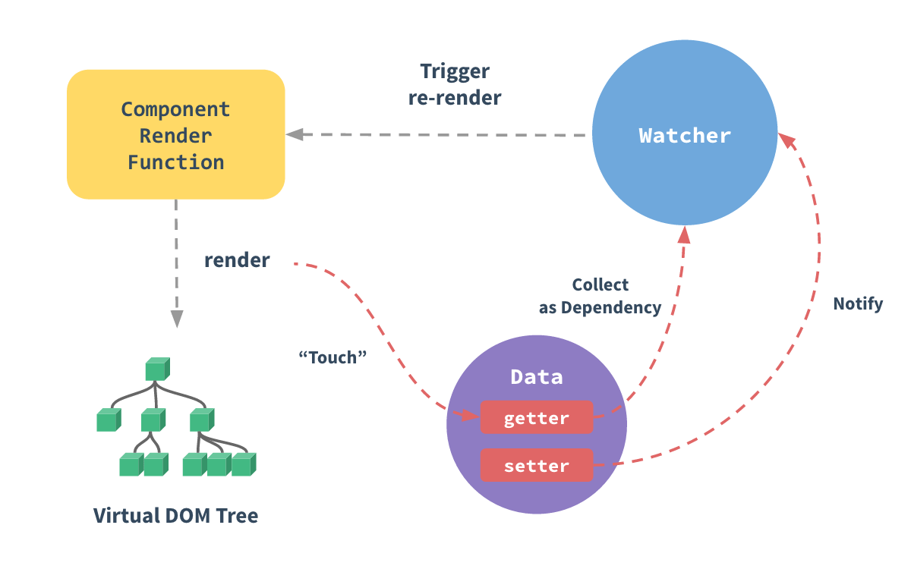

# Reactivity

## [[MDN] Proxy](https://developer.mozilla.org/ko/docs/Web/JavaScript/Reference/Global_Objects/Proxy)

## Reactivity in Depth

vue2 와 vue3 가 각각 reactivity 를 구현하는 방식이 다름  
- vue2 - Object.defineProperty
- vue3 - Proxy

vue2 의 Object.defineProperty 한계점 존재 (데이터에 미리 정의되어 있지 않은경우, 즉 defineProperty 정의가 되어 있지 않기 때문에 동작하지 않음)  
vue3 에서는 Proxy 방식으로 변경함으로써 어떤 속성들이 들어오건간에 동일한 프록시의 동작으로 엮어 낼 수 있게 되었다 

[[Vue2] Reactivity in Depth](https://v2.vuejs.org/v2/guide/reactivity.html)

[[Vue3] Reactivity in Depth](https://vuejs.org/guide/extras/reactivity-in-depth.html#what-is-reactivity)

When you pass a plain JavaScript object to a Vue instance as its data option, Vue will walk through all of its properties and convert them to getter/setters using Object.defineProperty. This is an ES5-only and un-shimmable feature, which is why Vue doesn’t support IE8 and below.
> Vue 인스턴스에 일반 JavaScript 객체를 데이터 옵션으로 전달하면 Vue는 모든 속성을 검토하고 Object.defineProperty를 사용하여 getter/setter로 변환합니다. 이는 ES5에서만 지원되며 shimming이 불가능한 기능이므로 Vue는 IE8 이하를 지원하지 않습니다. 

The getter/setters are invisible to the user, but under the hood they enable Vue to perform dependency-tracking and change-notification when properties are accessed or modified. One caveat is that browser consoles format getter/setters differently when converted data objects are logged, so you may want to install vue-devtools for a more inspection-friendly interface.
> getter/setter는 사용자에게는 보이지 않지만, 내부적으로는 속성에 액세스하거나 수정할 때 Vue가 종속성 추적 및 변경 알림을 수행할 수 있도록 합니다. 한 가지 주의할 점은 변환된 데이터 객체가 기록될 때 브라우저 콘솔에서 getter/setter 형식을 다르게 지정하므로, 보다 직관적인 인터페이스를 위해 vue-devtools를 설치하는 것이 좋습니다. 

Every component instance has a corresponding watcher instance, which records any properties “touched” during the component’s render as dependencies. Later on when a dependency’s setter is triggered, it notifies the watcher, which in turn causes the component to re-render.
> 모든 컴포넌트 인스턴스에는 해당 watcher 인스턴스가 있으며, 이 인스턴스는 컴포넌트 렌더링 중에 "변경된" 모든 속성을 종속성으로 기록합니다. 나중에 종속성의 setter가 트리거되면 watcher에 알림을 보내고, watcher는 컴포넌트를 다시 렌더링합니다.
