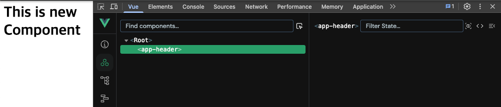
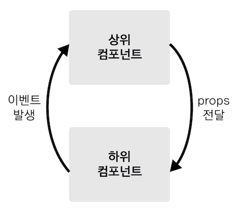
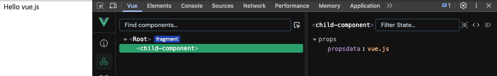
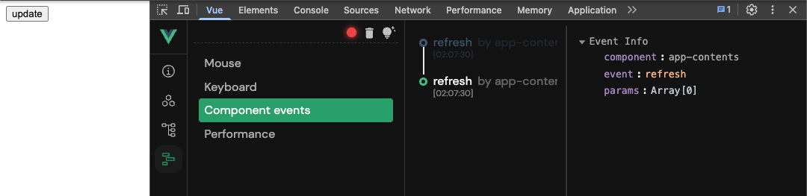

# Components

[Vue Component](https://joshua1988.github.io/vue-camp/vue/components.html)

컴포넌트는 화면의 영역을 구분하여 개발할 수 있는 뷰의 기능입니다. 컴포넌트 기반으로 화면을 개발하게 되면 코드의 재사용성이 올라가고 빠르게 화면을 제작할 수 있습니다.

우측을 컴포넌트 트리라고 부른다  
제일 위 컴포넌트를 최상위 컴포넌트, 루트 컴포넌트 라고 부른다  


## 생성 

vue2
```vue
Vue.component('컴포넌트 이름', {
  // 컴포넌트 내용
});
 
```

vue3
```vue
// 인스턴스 생성
var app = Vue.createApp();

app.component('컴포넌트 이름', {
// 컴포넌트 내용
});
```

## 렌더링

앱 헤더 컴포넌트 생성

vue2
```vue
Vue.component('app-header', {
  template: '<h1>Header Component</h1>'
});
```

등록한 컴포넌트를 화면에 렌더링  
컴포넌트 태그(컴포넌트 이름)을 추가

```html
<div id="app">
  <app-header></app-header>
</div>
```

아래와 같은 결과를 가져옴

```html
<div id="app">
  <h1>Header Component</h1>
</div>
```

## 등록 방법

### 전역 컴포넌트 등록

vue2
```vue
// 전역 컴포넌트 등록
Vue.component('app-header', {
  template: '<h1>Header Component</h1>'
});
```

vue3
```vue
// 인스턴스 생성
var app = Vue.createApp();

// 전역 컴포넌트 등록
app.component('app-header', {
  template: '<h1>Header Component</h1>'
});
```

### 지역 컴포넌트 등록

vue2
```vue
var appHeader = {
  template: '<h1>Header Component</h1>'
}

new Vue({
  // 지역 컴포넌트 등록
  components: {
    'app-header': appHeader
  }
})
```

vue3
```vue
var appHeader = {
  template: '<h1>Header Component</h1>'
}

Vue.createApp({
  // 지역 컴포넌트 등록
  components: {
    'app-header': appHeader
  }
})
```

## 컴포넌트 DevTool 확인



## 통신 방식

뷰 컴포넌트는 각각 고유한 데이터 유효 범위를 갖습니다. 따라서, 컴포넌트 간에 데이터를 주고 받기 위해선 아래와 같은 규칙을 따라야 합니다.



- 상위에서 하위로는 데이터를 내려줌, Props 속성
- 하위에서 상위로는 이벤트를 올려줌, Event 발생

### Props

프롭스 속성은 컴포넌트 간에 데이터를 전달할 수 있는 컴포넌트 통신 방법입니다. 프롭스 속성을 기억할 때는 상위 컴포넌트에서 하위 컴포넌트로 내려보내는 데이터 속성으로 기억하면 쉽습니다.

vue2
```vue
// 하위 컴포넌트 : childComponent
var childComponent = {
  props: ['propsdata'],
  template: '<p>{{ propsdata }}</p>'
}

// 상위 컴포넌트 : root 컴포넌트
new Vue({
  el: '#app',
  components: {
    'child-component': childComponent
  },
  data: {
    message: 'hello vue.js'
  }
})
```

vue3
```vue
// 하위 컴포넌트 : childComponent
var childComponent = {
  props: ['propsdata'],
  template: '<p>{{ propsdata }}</p>'
}

// 상위 컴포넌트 : root 컴포넌트
Vue.createApp({
  components: {
    'child-component': childComponent
  },
  data: {
    message: 'hello vue.js'
  }
}).mount('#app');
```

```html
<div id="app">
  <child-component v-bind:propsdata="message"></child-component>
  <!-- 위의 출력 결과는 hello vue.js -->
</div>
```



### Event Emit

이벤트 발생은 컴포넌트의 통신 방법 중 하위 컴포넌트에서 상위 컴포넌트로 통신하는 방식입니다.

vue2
```vue
// 하위 컴포넌트 : childComponent
var childComponent = {
  methods: {
    sendEvent: function() {
      this.$emit('update');
    }
  }
}

// 상위 컴포넌트 : root 컴포넌트
new Vue({
  el: '#app',
  components: {
    'child-component': childComponent
  },
  methods: {
    showAlert: function() {
      alert('event received');
    }
  }
})
```

vue3
```vue
// 하위 컴포넌트 : childComponent
var childComponent = {
  methods: {
    sendEvent: function() {
      this.$emit('update');
    }
  }
}

// 상위 컴포넌트 : root 컴포넌트
Vue.createApp({
  components: {
    'child-component': childComponent
  },
  methods: {
    showAlert: function() {
      alert('event received');
    }
  }
}).mount('#app')
```

```html
<div id="app">
  <child-component v-on:update="showAlert"></child-component>
</div>
```


