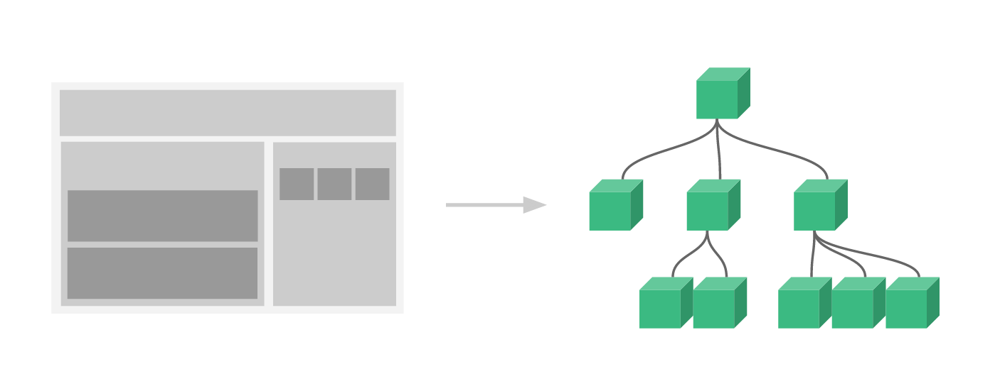

# Components

[Vue Component](https://joshua1988.github.io/vue-camp/vue/components.html)

컴포넌트는 화면의 영역을 구분하여 개발할 수 있는 뷰의 기능입니다. 컴포넌트 기반으로 화면을 개발하게 되면 코드의 재사용성이 올라가고 빠르게 화면을 제작할 수 있습니다.

우측을 컴포넌트 트리라고 부른다  
제일 위 컴포넌트를 최상위 컴포넌트, 루트 컴포넌트 라고 부른다  




## 생성 

vue2
```vue
Vue.component('컴포넌트 이름', {
  // 컴포넌트 내용
});
 
```

vue3
```vue
// 인스턴스 생성
var app = Vue.createApp();

app.component('컴포넌트 이름', {
// 컴포넌트 내용
});
```

## 렌더링

앱 헤더 컴포넌트 생성

vue2
```vue
Vue.component('app-header', {
  template: '<h1>Header Component</h1>'
});
```

등록한 컴포넌트를 화면에 렌더링  
컴포넌트 태그(컴포넌트 이름)을 추가

```html
<div id="app">
  <app-header></app-header>
</div>
```

아래와 같은 결과를 가져옴

```html
<div id="app">
  <h1>Header Component</h1>
</div>
```

## 등록 방법

### 전역 컴포넌트 등록

vue2
```vue
// 전역 컴포넌트 등록
Vue.component('app-header', {
  template: '<h1>Header Component</h1>'
});
```

vue3
```vue
// 인스턴스 생성
var app = Vue.createApp();

// 전역 컴포넌트 등록
app.component('app-header', {
  template: '<h1>Header Component</h1>'
});
```

### 지역 컴포넌트 등록

vue2
```vue
var appHeader = {
  template: '<h1>Header Component</h1>'
}

new Vue({
  // 지역 컴포넌트 등록
  components: {
    'app-header': appHeader
  }
})
```

vue3
```vue
var appHeader = {
  template: '<h1>Header Component</h1>'
}

Vue.createApp({
  // 지역 컴포넌트 등록
  components: {
    'app-header': appHeader
  }
})
```
