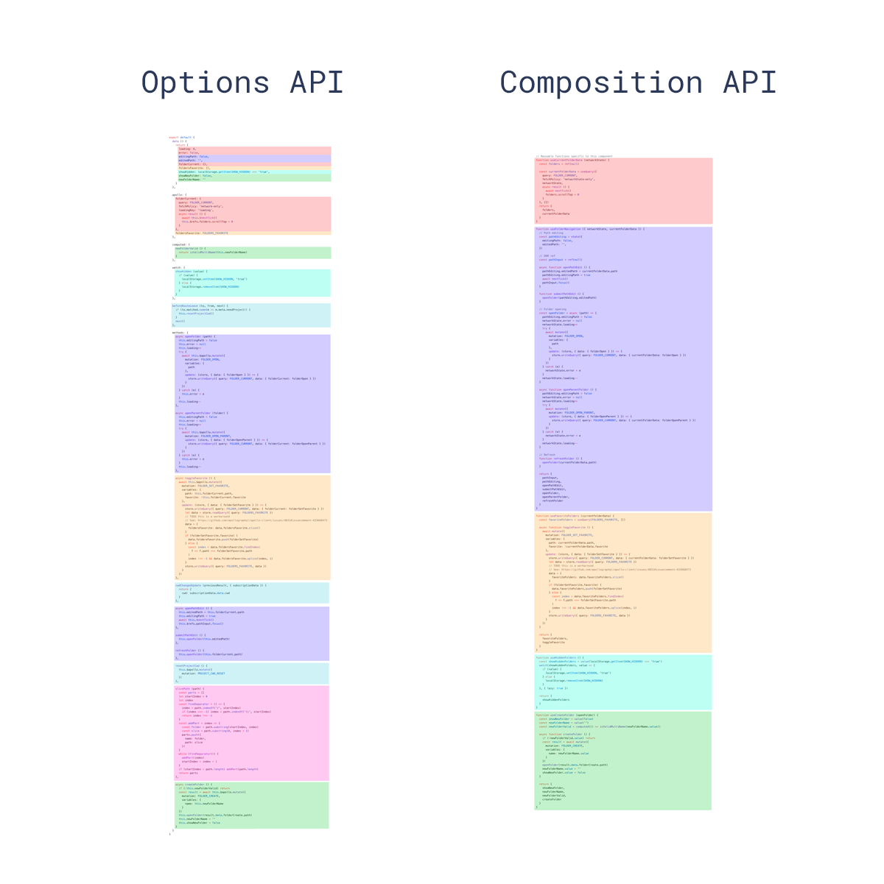

# Options API vs Composition API

[Vue3 API Reference](https://vuejs.org/api/)

- **Options API**는 `data`, `methods`, `mounted` 와 같은 옵션을 사용
- **Composition API**는 반응형 코드를 작성하는 단일 `setup` 함수가 존재
  - Composition API는 옵션(data, methods, ...)을 선언하는 대신 가져온 함수(ref, onMounted, ...)를 사용하여 Vue 컴포넌트를 작성할 수 있는 API 세트를 의미

[Options API example](./board-sample/src/components/options_vs_composition_api/CounterOptionsApi.vue)

[Composition API example](./board-sample/src/components/options_vs_composition_api/CounterCompositionApi.vue)

## Options API 

```vue
export default {
	data() {
		return {
			counter: 0,
			books: [],
		};
	},
	methods: {
		increment() {
			this.counter++;
		},
		addBook(title, author) {
      this.books.push({ title, author });
    },
	},
	computed: {
    firstBook() {
      return this.books[0];
    }
  }
	mounted() {
		console.log('애플리케이션이 마운트 되었습니다!');
	},
};
```

동일한 논리적 관심사(book, counter)를 처리하는 코드가 파일의 다른 부분에 분산되어 있어 코드를 분석하기가 힘들다  

## Composition API

```vue
<script setup>
import { onMounted, reactive, ref } from 'vue';

// counter 관심사
const counter = ref(0);
const increment = () => {
	counter.value++;
};

// book 관심사
const books = reactive([]);
const addBook = (title, author) => {
	books.push({ title, author });
};

onMounted(() => {
	console.log('애플리케이션이 마운트 되었습니다!');
});
</script>
```

Composition API를 사용하면 동일한 논리적 관심사 코드가 그룹화 되어 코드를 분석하기도 쉽고 유지보수가 용이해진다
또한 논리적 관심사 코드를 외부 유틸 파일로 추출하기가 쉽다



[Composition API FAQ](https://ko.vuejs.org/guide/extras/composition-api-faq.html)

## 재사용성

Composition API의 가장 큰 장점은 [Composable 함수](https://ko.vuejs.org/guide/reusability/composables)의 형태로 로직의 재사용이 가능

Options API의 기본 로직 재사용 메커니즘인 Mixins의 모든 단점을 해결

- **Compositions API는 Options API가 가지고 있던 2가지 주요 제한 사항을 해결.**
    - **hook**를 사용하여 관련 **코드 조각을 함께 그룹화**
    - **Composables**을 사용하면 애플리케이션 전체에서 **코드를 매우 쉽게 재사용**