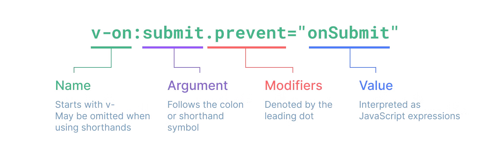

# 디렉티브 (directives)

[Built-in Directives](https://vuejs.org/api/built-in-directives.html)

디렉티브(directives)는 `v-`접두사가 있는 특수 속성 
디렉티브(directives)는 그대로 직역하면 지시를 뜻함, 
디렉티브(directives)는 기능상에서 중요한 역할인 컴포넌트(또는 DOM 요소)에게 “**~~하게 작동하라”** 하고 지시를 해주는 지시문을 말한다

Vue는 여러내장 디렉티브를 제공

- `v-text`
- `v-html`
- `v-show`
- `v-if`
- `v-else`
- `v-else-if`
- `v-for`
- `v-on` (단축표기 `@`)
- `v-bind` (단축표기 `:`)
- `v-model`
- `v-slot` (단축표기 `#`)
- `v-pre`
- `v-once`
- `v-cloak`
- `v-memo` (`v3.2+`)

## 디렉티브 구성

디렉티브는 다음과 같이 구성되어 있습니다.

- **`디렉티브(directives)`** : `v-` 접두사가 있는 특수 속성으로 디렉티브의 `값(value)`이 변경될 때 특정 효과를 반응적으로 DOM에 적용하는 것을 말합니다.
- **`전달인자(Argument)`** : 일부 디렉티브는 디렉티브명 뒤에 콜론(:)으로 표기되는 전달인자를 가질 수 있습니다. 예를 들어, `v-bind` 디렉티브는 반응적으로 HTML 속성을 갱신하는 데 사용합니다.
    - `동적 전달인자` : 대괄호를 사용하여 전달인자를 동적으로 삽입할 수 있습니다.
    `<a v-bind:[attributeName]="url"> ... </a>`
- **`수식어(Modifiers)`** : 수식어는 `점(.)`으로 표시되는 특수 접미사로 디렉티브가 특별한 방식으로 바인딩되어야 함을 나타냅니다.

## Custom Directives

https://vuejs.org/guide/reusability/custom-directives.html